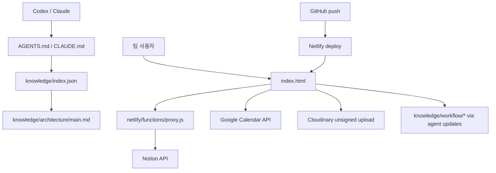

# Architecture

## 1. 프로젝트 목적

Newpeak Todo Webboard는 팀별 업무, 고정 스케줄, 디자인/콘텐츠 요청, CRM 일정, Google Calendar 보조 일정, Notion 데이터를 하나의 경량 웹 화면에서 운영하기 위한 앱이다.

가장 중요한 운영 기준은 다음 세 가지다.

| 기준 | 의미 |
| --- | --- |
| 운영 안정성 | 실제 팀 업무 보드가 깨지지 않아야 한다. |
| 단일 파일 제약 | `index.html`은 빌드 파이프라인 없이 단일 실행 단위로 유지한다. |
| 배포 통제 | GitHub push가 Netlify 배포로 이어지므로 push는 명시 요청 전 금지한다. |

## 2. IDA+SDA 정합 요소

첨부된 IDA/SDA 문서 중 이 프로젝트와 맞는 요소만 채택한다.

| 요소 | 판정 | 적용 방식 |
| --- | --- | --- |
| IDA 단일 진실원 | 채택 | `knowledge/index.json`을 최상위 색인으로 둔다. |
| IDA 아키텍처 문서 | 채택 | 이 문서가 계층, 책임, 의존 관계를 설명한다. |
| IDA 작업 이력 | 채택 | `knowledge/workflow/session_ledger.md`에 append-only로 기록한다. |
| IDA 결함 로그 | 채택 | `knowledge/workflow/weakness_log.md`에 상태값을 남긴다. |
| SDA 관심사 분리 | 부분 채택 | 물리적 코드 분해 대신 지침/실행/관찰 레이어를 문서로 분리한다. |
| SDA 단방향 의존 | 채택 | 실행 파일은 지침과 외부 API를 사용하고, 지침은 실행 상세를 과도하게 포함하지 않는다. |
| SDA 회귀 게이트 | 채택 | `tools/check-js-syntax.mjs`를 최소 검증 기준선으로 둔다. |
| SDA 5-레이어 폴더 이동 | 보류 | `index.html` 단일 파일 제약과 충돌하므로 이동하지 않는다. |
| autonomous-patch 자동 루프 | 보류 | 배포 위험이 있어 사용자 요청 없이 push/배포까지 자동화하지 않는다. |

## 3. 계층 구조

| 계층 | 책임 | 포함 파일 |
| --- | --- | --- |
| L1 Instruction | Codex/Claude가 세션 시작 시 읽는 얇은 운영 규칙 | `AGENTS.md`, `CLAUDE.md`, `.claude/settings*.json` |
| L2 Execution | 실제 앱 실행과 API 프록시 | `index.html`, `netlify/functions/proxy.js`, `netlify.toml` |
| L3 Observation | 색인, 이력, 결함, 용어 | `knowledge/index.json`, `knowledge/architecture/main.md`, `knowledge/workflow/*` |
| L4 Human Runbook | 사람용 운영 절차 | `[정보 없음]`, 필요 시 `OPERATIONAL.md` 생성 |
| L5 Agent Memory | 프로젝트 간 장기 기억 | 현재 프로젝트 내부에는 두지 않음 |

## 4. 의존 관계

## 5. 모듈 카탈로그

| 모듈 | 책임 | 등급 | 입력 | 출력 | 테스트 |
| --- | --- | --- | --- | --- | --- |
| `browser_app` | 단일 페이지 UI, 상태, Notion 호출, 렌더링 | Tier 0 | 사용자 입력, Notion, Google Calendar | DOM, Notion 업데이트 | `tools/check-js-syntax.mjs` |
| `notion_proxy` | 브라우저와 Notion API 사이의 CORS 프록시 | Tier 0 | HTTP 요청, `x-notion-token` | Notion API 응답 | `tools/check-js-syntax.mjs` |
| `netlify_deployment_config` | 함수 경로와 캐시 헤더 | Tier 1 | Netlify 빌드 | 배포 설정 | 수동 확인 |
| `agent_instructions` | Codex 작업 규칙과 위험 경계 | Tier 1 | 사용자 지침, 프로젝트 상태 | 세션 운영 기준 | 수동 확인 |
| `architecture_knowledge` | IDA/SDA 색인, 이력, 결함, 용어 | Tier 1 | 코드 구조, 세션 결과 | 다음 세션용 지도 | JSON 파싱 |

## 6. 주요 데이터 흐름

| 흐름 | 생산자 | 소비자 | 정합 기준 |
| --- | --- | --- | --- |
| Todo 생성 | `addTask()` | Notion 주간 태스크 DB, `S.tasks` | 날짜, 담당자, 완료=false가 일치 |
| Todo 완료 | `doToggle()` | Notion 주간 태스크 DB, 이번주 완료 렌더 | 완료 기준은 선택 날짜가 아니라 완료시점 |
| 이월 업무 | `loadCarried()` | 미완료 섹션 | 오늘 이전 날짜의 미완료만 이월 |
| 고정 스케줄 | `loadSched()` | 고정 업무 패널 | 요일/월일과 담당자 기준 |
| CRM 카드 | CRM 함수군 | CRM 캘린더와 상세 모달 | Notion callout 파싱/저장 왕복 |
| 디자인 요청 | 디자인 함수군 | 디자인 탭 | 상태와 데드라인 필터 |
| 콘텐츠 요청 | 콘텐츠 함수군 | 콘텐츠 탭 | 상태와 데드라인 필터 |

## 7. 변경 동기화 규약

| 변경 유형 | 함께 갱신할 파일 |
| --- | --- |
| 새 Notion DB 또는 외부 API 추가 | `knowledge/index.json`, `knowledge/architecture/main.md`, `knowledge/workflow/domain_glossary.md` |
| 완료/날짜/주간 필터 로직 변경 | `knowledge/index.json`, `knowledge/workflow/session_ledger.md`, 관련 수동 검증 기록 |
| 배포/푸시 방식 변경 | `AGENTS.md`, `knowledge/index.json`, `knowledge/workflow/session_ledger.md` |
| 반복 결함 발견 | `knowledge/workflow/weakness_log.md` |
| 테스트 또는 검증 도구 추가 | `knowledge/index.json`, 이 문서의 모듈 카탈로그 |

## 8. 변경 시 주의점

- `index.html` 분리는 현재 금지된 구조 변경이다.
- `token.txt`와 토큰성 파일 내용은 읽거나 출력하지 않는다.
- Notion API는 브라우저에서 직접 호출하지 않고 프록시를 경유한다.
- 완료 카드의 주간 귀속 기준은 `완료시점`이다. 선택한 캘린더 날짜가 완료 날짜를 대체하면 안 된다.
- push 전에는 Netlify 자동 배포 영향 범위를 사용자에게 먼저 보고한다.
